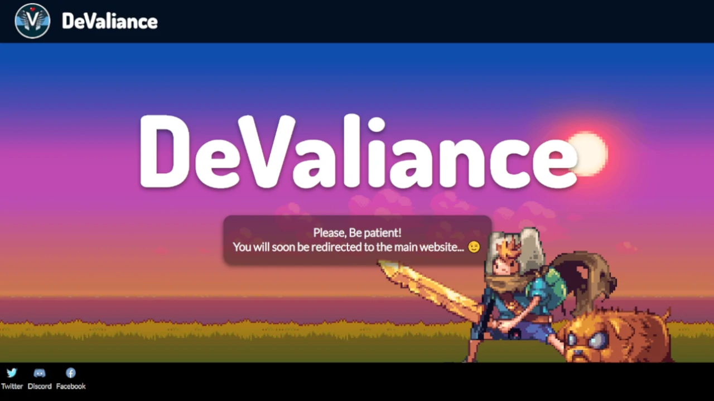

  

 

# ↪️ DeValiance Redirect
> This page serves as a redirect page to the website. DeValiance is a fictitious small indie game development studio for my web design coursework.

>Live demo:
[devaliance.000webhostapp.com](devaliance.000webhostapp.com/ "DeValiance Redirect")

 

>

 

## ✒️ General Information 
DeValiance is the first website I have ever created from scratch using only HTML, CSS and JavaScript.

It is a static website that showcases real games 🎮 I have created, and makes maximum use of all the different things I have learnt in the module. The project also consists of additional pages separated from the main website to learn Bootstrap and JavaScript.

 

**🛈 NOTE:**

This webpage only serves as a redirect page to the <a href='https://mistervaliant.github.io/devaliance/index.html'>main website</a>.

 

## ❤️ Motivation
The main aim of devaliance-redirect is to better understand how to host and maintain websites using FileZilla on another host platform except github-pages.

 

## 👨‍💻 Technologies Used

  

 

## 📌 Features
1. Automatically redirects to the main website after 8 seconds

 

## 📷 Screenshots

 

<!-- ## 🗺️ Room for Improvement
Issues:

  -->

## 🔗 Acknowledgements

Hero image from: <a href='https://wall.alphacoders.com/big.php?i=681583'>alphacoders.com</a>

 

## Contact
Created by [@MisterValiant](https://github.com/MisterValiant) - feel free to contact me! 📧